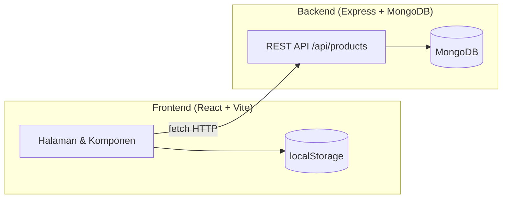
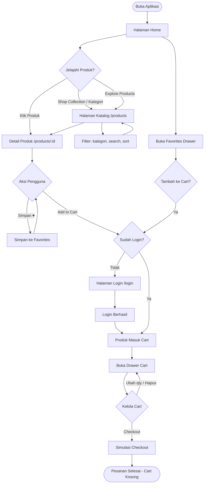
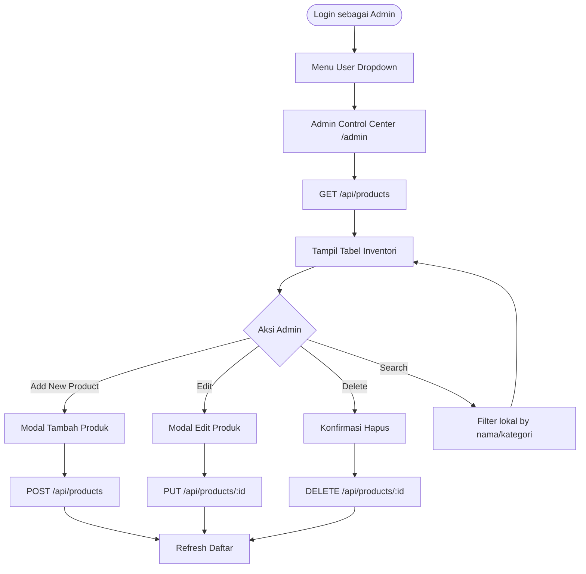
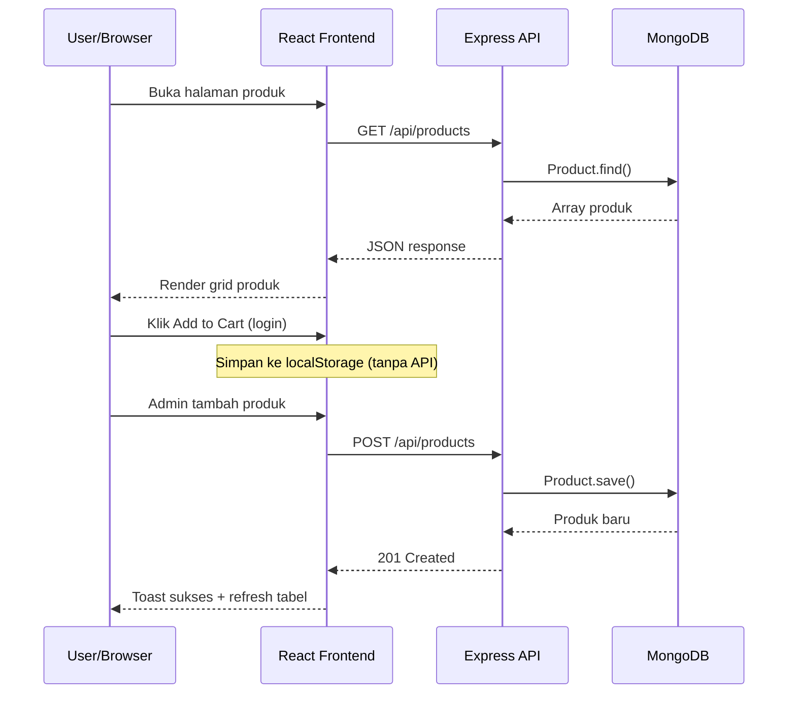

# Tukufy Shop — Dokumentasi Aplikasi

**Tukufy Shop** adalah aplikasi e-commerce untuk produk audio & aksesori digital. Arsitekturnya memisahkan **backend REST API** (Node.js + Express + MongoDB) dan **frontend SPA** (React + Vite).

---

## Arsitektur Sistem



| Layer | Teknologi | Port |
|-------|-----------|------|
| Frontend | React 19, Vite, React Router, Lucide Icons | `5173` (default Vite) |
| Backend | Express 4, Mongoose, CORS | `5001` |
| Database | MongoDB (atau in-memory jika tanpa `MONGODB_URI`) | — |

---

## Backend

### Struktur Folder

```
backend/
├── server.js          # Entry point, koneksi DB, seeding
├── models/Product.js  # Skema Mongoose
└── routes/products.js # Endpoint CRUD produk
```

### Model Produk (`Product`)

| Field | Tipe | Keterangan |
|-------|------|------------|
| `name` | String | Nama produk (wajib) |
| `description` | String | Deskripsi lengkap |
| `price` | Number | Harga (min 0) |
| `category` | String | Headphones, Earbuds, Speakers, Accessories |
| `image` | String | URL gambar |
| `stock` | Number | Stok tersedia |
| `rating` | Number | 0–5 (default 4.5) |
| `reviewsCount` | Number | Jumlah review |
| `specifications` | Array | `{ key, value }` spesifikasi teknis |
| `createdAt`, `updatedAt` | Date | Auto dari timestamps |

### API Endpoints

| Method | Endpoint | Fungsi |
|--------|----------|--------|
| `GET` | `/api/health` | Status server & koneksi DB |
| `GET` | `/api/products` | Semua produk (filter: `?category=`, `?search=`) |
| `GET` | `/api/products/:id` | Detail satu produk |
| `POST` | `/api/products` | Tambah produk baru |
| `PUT` | `/api/products/:id` | Update produk |
| `DELETE` | `/api/products/:id` | Hapus produk |

### Fitur Backend

- **Auto-seeding**: Jika database kosong, 8 produk contoh otomatis diisi saat startup.
- **In-memory MongoDB**: Jika `MONGODB_URI` tidak diset, server memakai `mongodb-memory-server`.
- **Tidak ada autentikasi API**: Semua endpoint produk terbuka tanpa token.

### Menjalankan Backend

```bash
cd backend
npm install
npm run dev   # atau npm start
```

---

## Frontend

### Struktur Folder

```
frontend/src/
├── App.jsx              # State global, routing, cart & favorites drawer
├── components/
│   ├── Header.jsx       # Navigasi, cart, favorites, user menu
│   └── Footer.jsx       # Footer situs
└── pages/
    ├── Home.jsx         # Landing + featured products
    ├── ProductList.jsx  # Katalog dengan filter & sort
    ├── ProductDetail.jsx# Detail produk
    ├── Admin.jsx        # Panel CRUD admin
    ├── Login.jsx        # Login (mock)
    └── SignUp.jsx       # Registrasi (mock)
```

### Routing

| Path | Halaman | Akses |
|------|---------|-------|
| `/` | Home | Publik |
| `/products` | Katalog produk | Publik |
| `/products/:id` | Detail produk | Publik |
| `/login` | Login | Publik |
| `/signup` | Sign Up | Publik |
| `/admin` | Admin Control Center | Semua user (tanpa guard) |

### State Management

State disimpan di `App.jsx` dan di-persist ke **localStorage**:

| Key | Isi |
|-----|-----|
| `tukufy_user` | Data user login |
| `tukufy_cart` | Item keranjang `{ product, quantity }[]` |
| `tukufy_favorites` | Produk favorit |

### Autentikasi (Mock)

- Login/Sign Up **tidak** memanggil backend — hanya simulasi dengan `setTimeout`.
- Akun template:
  - **Admin**: `admin@tukufy.com` / `admin123` → role `admin`
  - **User**: `user@tukufy.com` / `user123` → role `customer`
- Logout menghapus user, cart, dan favorites dari localStorage.

### Fitur Pengguna

| Fitur | Keterangan |
|-------|------------|
| Browse produk | Home, katalog, detail |
| Filter & search | Kategori, nama, sort harga/rating |
| Favorites | Simpan produk (tanpa login) |
| Cart | Wajib login; validasi stok |
| Checkout | Simulasi — cart dikosongkan setelah klik checkout |
| Admin CRUD | Tambah, edit, hapus produk via API |

### Menjalankan Frontend

```bash
cd frontend
npm install
npm run dev
```

Backend harus berjalan di `http://localhost:5001`.

---

## Flowchart Penggunaan Aplikasi

### Alur Umum (Customer)



### Alur Autentikasi

```mermaid
flowchart TD
    Guest([Pengunjung]) --> AuthChoice{Pilih Aksi}

    AuthChoice -->|Log In| LoginPage[/login]
    AuthChoice -->|Sign Up| SignUpPage[/signup]

    LoginPage --> Template{Pakai Template?}
    Template -->|Admin| AdminCred[admin@tukufy.com]
    Template -->|User| UserCred[user@tukufy.com]
    Template -->|Manual| ManualLogin[Isi email & password]
    AdminCred --> SubmitLogin[Submit Login]
    UserCred --> SubmitLogin
    ManualLogin --> SubmitLogin

    SubmitLogin --> SaveLS[Simpan ke localStorage]
    SaveLS --> Redirect[Kembali ke halaman sebelumnya]

    SignUpPage --> FillForm[Isi nama, email, password]
    FillForm --> Validate{Valid?}
    Validate -->|Tidak| FillForm
    Validate -->|Ya| SaveLS2[Simpan user ke localStorage]
    SaveLS2 --> HomeRedirect[Redirect ke Home]

    LoggedIn([User Login]) --> Logout[Log Out]
    Logout --> ClearLS[Hapus user, cart, favorites]
    ClearLS --> Guest
```

### Alur Admin



---

## Alur Data (Request–Response)



---

## Ringkasan

| Aspek | Backend | Frontend |
|-------|---------|----------|
| **Fokus** | CRUD produk & penyimpanan data | UI toko online & pengalaman belanja |
| **Auth** | Tidak ada | Mock via localStorage |
| **Persistensi** | MongoDB | localStorage (cart, fav, user) |
| **Kategori** | Headphones, Earbuds, Speakers, Accessories | Sama |
| **Keterbatasan** | Tidak ada proteksi endpoint admin | Checkout & auth hanya simulasi |

Aplikasi ini cocok sebagai **proyek pembelajaran full-stack**: backend menyediakan REST API nyata dengan MongoDB, sementara frontend menangani UX e-commerce lengkap dengan cart, favorites, dan panel admin — tanpa integrasi payment atau autentikasi server-side yang sesungguhnya.
